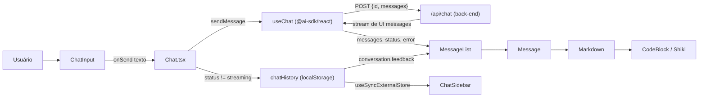

# Chat IESB Web (`apps/web`)

Interface de usuário do assistente virtual (exibido na UI como **Atlas**), desenvolvida com **React 19**, **Vite**, **TypeScript** e **Tailwind CSS v4**. Oferece uma experiência de chat fluida, responsiva e acessível para os alunos da instituição, com respostas em *streaming*, renderização de Markdown/código, histórico local de conversas e tema claro/escuro.

> Este pacote contém **apenas o front-end**. O endpoint de chat (`POST /api/chat`) é consumido por ele, mas não faz parte deste pacote — veja [Contrato com o back-end](#-contrato-com-o-back-end).

---

## 📑 Sumário

1. [Visão geral](#-visão-geral)
2. [Stack](#-stack)
3. [Pré-requisitos](#-pré-requisitos)
4. [Como executar](#-como-executar)
5. [Scripts disponíveis](#-scripts-disponíveis)
6. [Variáveis de ambiente](#-variáveis-de-ambiente)
7. [Estrutura de pastas](#-estrutura-de-pastas)
8. [Arquitetura](#-arquitetura)
9. [Contrato com o back-end](#-contrato-com-o-back-end)
10. [Persistência local](#-persistência-local)
11. [Design system e tema](#-design-system-e-tema)
12. [Acessibilidade e UX](#-acessibilidade-e-ux)
13. [Atalhos de teclado](#-atalhos-de-teclado)
14. [Build e deploy (Docker)](#-build-e-deploy-docker)
15. [Convenções de código](#-convenções-de-código)
16. [Guias para tarefas comuns](#-guias-para-tarefas-comuns)
17. [Troubleshooting](#-troubleshooting)
18. [Pontos de atenção conhecidos](#-pontos-de-atenção-conhecidos)

---

## 🔎 Visão geral

| Recurso | Descrição |
| --- | --- |
| Chat com streaming | Tokens aparecem conforme chegam, com atualização da UI em lotes (*throttle* de 40 ms). |
| Markdown completo | GFM (tabelas, listas, tarefas, *strikethrough*) via `react-markdown` + `remark-gfm`. |
| Blocos de código | Destaque de sintaxe com **Shiki** (carregado sob demanda), botão de copiar. |
| Raciocínio do modelo | Partes `reasoning` da resposta são exibidas em um bloco recolhível. |
| Ações por mensagem | Copiar, regenerar (última resposta), feedback 👍/👎, horário de envio. |
| Histórico local | Conversas salvas no `localStorage`, agrupadas por data na barra lateral. |
| Tema | Claro, escuro ou sistema, persistido entre sessões. |
| Responsivo | Barra lateral *off-canvas* no mobile, respeito a *safe areas* (iOS). |
| Tratamento de erros | Mensagens amigáveis em PT-BR, com "Tentar novamente". |

---

## 🧰 Stack

| Camada | Tecnologia | Versão (package.json) |
| --- | --- | --- |
| Framework | React | `^19.2` |
| Build / dev server | Vite (+ `@vitejs/plugin-react`) | `^8.2` |
| Linguagem | TypeScript | `~6.0` |
| Estilos | Tailwind CSS v4 (`@tailwindcss/vite`), `tw-animate-css` | `^4.3` |
| Componentes base | shadcn/ui (estilo `base-nova`) sobre `@base-ui/react` | `^1.8` |
| Ícones | `lucide-react` | `^1.48` |
| Chat / streaming | Vercel AI SDK: `ai` + `@ai-sdk/react` (`useChat`) | `^7.0` / `^4.0` |
| Markdown | `react-markdown`, `remark-gfm` | `^10.1` / `^4.0` |
| Syntax highlight | `shiki` | `^4.4` |
| Tema | `next-themes` (funciona em Vite; alterna a classe `.dark`) | `^0.4` |
| Toasts | `sonner` | `^2.0` |
| Fontes | Geist e Geist Mono (`@fontsource-variable`) | — |
| Lint | ESLint 10 + `typescript-eslint` + plugins `react-hooks` e `react-refresh` | — |
| Gerenciador de pacotes | **pnpm** (monorepo com workspaces + Turborepo) | — |

---

## ✅ Pré-requisitos

- **Node.js 24** (mesma versão usada no `dockerfile`)
- **pnpm** — habilite via Corepack: `corepack enable`
- Acesso ao **back-end de chat** em execução (veja [Variáveis de ambiente](#-variáveis-de-ambiente) e [Contrato com o back-end](#-contrato-com-o-back-end))

---

## 🚀 Como executar

A partir da **raiz do monorepo**:

```bash
# 1. Instalar dependências (uma vez)
pnpm --filter web install

# 2. Iniciar apenas o front-end em modo de desenvolvimento
pnpm --filter web dev
```

O Vite sobe em `http://localhost:5173` (porta padrão). Alternativamente, de dentro de `apps/web`:

```bash
pnpm --filter web dev
```

Para simular produção localmente (build + servidor de *preview*):

```bash
pnpm --filter web prod
```

> ⚠️ O `vite preview` **não** executa as rotas de `/api` (o plugin de API só existe no servidor de desenvolvimento). Em `prod`/`preview`, o back-end precisa estar disponível separadamente.

---

## 📜 Scripts disponíveis

Definidos em `package.json`:

| Script | Comando | O que faz |
| --- | --- | --- |
| `dev` | `vite` | Servidor de desenvolvimento com HMR (e rotas `/api`, veja abaixo). |
| `build` | `tsc -b && vite build` | Checagem de tipos + build de produção em `dist/`. |
| `prod` | `pnpm run build && vite preview` | Build seguido de *preview* local do resultado. |
| `preview` | `vite preview` | Serve o conteúdo já gerado em `dist/`. |
| `lint` | `eslint .` | Roda o ESLint em todo o projeto. |

> Não há suíte de testes automatizados configurada neste momento.

---

## 🔐 Variáveis de ambiente

O arquivo `.env.example` existe, porém está **vazio**. As variáveis abaixo são as referenciadas no código:

| Variável | Onde é usada | Descrição |
| --- | --- | --- |
| `AI_GATEWAY_API_KEY` | `vite.config.ts` (lado servidor) | Chave do Vercel AI Gateway. É carregada com `loadEnv(mode, cwd, '')` para `process.env` e fica disponível **somente** para o código de `/api` — não é exposta ao navegador. |

Exemplo de `.env.local` (não versionado, coberto por `*.local` no `.gitignore`):

```dotenv
AI_GATEWAY_API_KEY=coloque-sua-chave-aqui
```

> Regra do Vite: apenas variáveis prefixadas com `VITE_` chegam ao código do navegador. Nunca prefixe segredos com `VITE_`.

---

## 🗂️ Estrutura de pastas

```
apps/web/
├── public/                    # Arquivos estáticos servidos na raiz (favicon.svg, icons.svg)
├── src/
│   ├── main.tsx               # Ponto de entrada: monta <App /> em #root (StrictMode)
│   ├── App.tsx                # Providers (tema, tooltip, sidebar), id da conversa ativa, atalho Ctrl/Cmd+Shift+O
│   ├── index.css              # Tailwind, tokens de tema (light/dark), animações, estilos do Shiki
│   ├── components/
│   │   ├── chat/              # Componentes de domínio do chat
│   │   │   ├── Chat.tsx           # Orquestra useChat, persistência, envio, regenerar, feedback
│   │   │   ├── ChatHeader.tsx     # Barra superior: toggle da sidebar, título, nova conversa, tema
│   │   │   ├── ChatSidebar.tsx    # Histórico agrupado por data, exclusão com confirmação
│   │   │   ├── ChatInput.tsx      # Textarea auto-ajustável, enviar/parar, atalhos
│   │   │   ├── MessageList.tsx    # Lista, auto-scroll, indicador de "digitando", alerta de erro
│   │   │   ├── Message.tsx        # Mensagem de usuário e de assistente (ações, raciocínio)
│   │   │   ├── Markdown.tsx       # Mapeamento de elementos Markdown → componentes estilizados
│   │   │   ├── CodeBlock.tsx      # Bloco de código com Shiki (lazy) e botão de copiar
│   │   │   ├── EmptyState.tsx     # Tela inicial com saudação e sugestões de prompt
│   │   │   ├── AssistantAvatar.tsx
│   │   │   └── TypingIndicator.tsx
│   │   ├── ui/                # Primitivos shadcn/ui (gerados pela CLI — evite editar muito)
│   │   ├── theme-provider.tsx # Wrapper do next-themes
│   │   └── theme-toggle.tsx   # Menu Claro / Escuro / Sistema
│   ├── hooks/
│   │   ├── use-chat-history.ts    # Store externa (localStorage) + hooks useConversations/useConversation
│   │   ├── use-auto-scroll.ts     # Auto-scroll "pegajoso" durante o streaming
│   │   ├── use-copy-to-clipboard.ts
│   │   └── use-mobile.ts          # Breakpoint mobile (768px)
│   ├── lib/
│   │   ├── chat.ts            # Helpers: texto/raciocínio da mensagem, formatação de hora, erros amigáveis
│   │   └── utils.ts           # cn(): clsx + tailwind-merge
│   ├── types/
│   │   └── chat.ts            # ChatMessage, Conversation, Feedback, ChatRequestBody
│   └── assets/                # Imagens do template inicial (hoje não referenciadas)
├── components.json            # Configuração da CLI do shadcn/ui
├── vite.config.ts             # Plugins (React, Tailwind), alias "@" e plugin de rotas /api em dev
├── eslint.config.js
├── tsconfig*.json
├── dockerfile                 # Build multi-stage: Node (build) → Nginx (runtime)
└── .env.example
```

O alias `@` aponta para `./src` (configurado em `vite.config.ts` e `tsconfig.json`). Use sempre `@/...` em vez de caminhos relativos longos.

---

## 🏗️ Arquitetura

### Fluxo de dados



### Decisões de design importantes

**1. `useChat` é o dono do estado "vivo" da conversa.**
`Chat.tsx` inicializa o `useChat` com as mensagens salvas **uma única vez** (`useState(() => conversation?.messages ?? [])`). Depois disso, o `useChat` controla o estado e o histórico apenas o espelha.

**2. Troca de conversa = remontagem.**
Em `App.tsx`, `<Chat key={chatId} ... />` força a remontagem do componente a cada troca de `chatId`, recarregando as mensagens da conversa selecionada. "Nova conversa" simplesmente gera um novo id (`generateId()` do pacote `ai`).

**3. Persistência só em estados estáveis.**
O `useEffect` de `Chat.tsx` ignora `status === 'streaming'`, evitando escrever no `localStorage` a cada token. Salva quando a mensagem é enviada, quando a resposta termina, é interrompida ou falha.

**4. Store externa com `useSyncExternalStore`.**
`use-chat-history.ts` implementa um pequeno *store* (assinantes + `localStorage`). Componentes só re-renderizam quando a fatia que selecionam muda, e várias abas ficam sincronizadas pelo evento `storage`.

**5. Auto-scroll "pegajoso".**
`use-auto-scroll.ts` acompanha o conteúdo novo **somente** se o usuário já estiver a até 96 px do fim. Ao rolar para cima, o acompanhamento pausa até o usuário voltar ao fim ou clicar no botão "rolar até a mais recente". Ao **enviar** uma mensagem, o scroll sempre vai ao fim.

**6. Performance durante o streaming.**
`Message` e `Markdown` são `memo`; o `throttle` do `useChat` agrupa atualizações (40 ms); o destaque do Shiki é *debounced* (120 ms) e o pacote é importado dinamicamente (`import('shiki')`), ficando fora do bundle inicial. Linguagens desconhecidas caem para `text`.

**7. Markdown sem plugin de tipografia.**
Os estilos de cada elemento (`h1`, `ul`, `table`, `a`…) estão no mapeamento `components` de `Markdown.tsx`, usando tokens do tema. Links abrem em nova aba com `rel="noopener noreferrer"`. Blocos de código são detectados por `language-*` ou por conterem quebra de linha.

**8. Mensagens do assistente vazias.**
Se uma resposta falhar sem produzir conteúdo, `AssistantMessage` retorna `null` e o alerta de erro (com "Tentar novamente" / "Dispensar") assume o lugar.

### Modelo de dados (`src/types/chat.ts`)

```ts
type MessageMetadata = { createdAt?: number; model?: string }
// createdAt: definido pelo cliente nas mensagens do usuário (e pelo servidor nas do assistente).
// model: definido pelo servidor.

type ChatMessage = UIMessage<MessageMetadata>
type Feedback = 'up' | 'down'

type Conversation = {
  id: string
  title: string
  createdAt: number
  updatedAt: number
  messages: ChatMessage[]
  feedback: Record<string, Feedback> // chave: id da mensagem do assistente
}

type ChatRequestBody = { id: string; messages: ChatMessage[] }
```

---

## 🔌 Contrato com o back-end

O front-end usa o `DefaultChatTransport` do AI SDK apontando para o endpoint de chat (ver `src/components/chat/Chat.tsx`).

**Requisição**

```http
POST /api/chat
Content-Type: application/json

{
  "id": "<id da conversa>",
  "messages": [ /* ChatMessage[] — formato UIMessage do AI SDK */ ]
}
```

**Resposta esperada:** *stream* de mensagens de UI do AI SDK (o mesmo protocolo consumido pelo `useChat`). O front-end sabe renderizar:

- partes `text` → resposta principal (Markdown);
- partes `reasoning` → bloco recolhível "Raciocínio";
- `metadata.createdAt` / `metadata.model` → horário exibido sob a mensagem.

**Interrupção:** o botão "Parar geração" cancela a requisição (`stop()`); o servidor deve tratar o *abort* do `Request`.

**Erros:** `getFriendlyErrorMessage` (`src/lib/chat.ts`) traduz falhas conhecidas:

| Condição (na mensagem do erro) | Texto exibido |
| --- | --- |
| `failed to fetch` / `network` | Sem conexão com o servidor… |
| `429` / `rate limit` | Muitas requisições em pouco tempo… |
| `401` / `403` / `unauthorized` | Não foi possível autenticar com o provedor de IA… |
| Mensagem curta (< 160 chars) e não-JSON | A própria mensagem |
| Qualquer outro caso | "Algo deu errado ao gerar a resposta…" |

### Rotas `/api` no ambiente de desenvolvimento

O `vite.config.ts` registra o plugin `dev-api-routes`, que serve arquivos da pasta `api/` durante o `pnpm dev` usando a mesma assinatura *Web* `Request → Response` das Vercel Functions:

- `GET/POST /api/<nome>` carrega `api/<nome>.ts` via `ssrLoadModule` e invoca o *export* nomeado pelo método HTTP (`export function POST(request) {}`);
- método sem *handler* → `405 Method Not Allowed`;
- desconexão do cliente → o `AbortController` da requisição é acionado;
- o contexto da requisição é espelhado para bibliotecas como `@vercel/oidc` (AI Gateway) lerem cabeçalhos.

> A pasta `api/` (ex.: `api/chat.ts`) **não está incluída no pacote analisado**, embora `tsconfig.json` e o plugin a esperem. Ela pode viver aqui ou em outro app do monorepo — confirme antes de depender dela.

Esboço **ilustrativo** de um *handler* compatível (confira a API exata da versão instalada de `ai`):

```ts
// api/chat.ts
import { convertToModelMessages, streamText } from 'ai'
import type { ChatRequestBody } from '../src/types/chat'

export async function POST(request: Request) {
  const { messages } = (await request.json()) as ChatRequestBody

  const result = streamText({
    model: '<provedor/modelo>',
    messages: await convertToModelMessages(messages),
    abortSignal: request.signal,
  })

  return result.toUIMessageStreamResponse({
    messageMetadata: () => ({ createdAt: Date.now(), model: '<provedor/modelo>' }),
  })
}
```

---

## 💾 Persistência local

Tudo é salvo **no navegador do usuário**; não há sincronização entre dispositivos.

| Chave (`localStorage`) | Conteúdo |
| --- | --- |
| `atlas.conversations.v1` | Array de `Conversation` (mensagens + feedback). O sufixo `v1` permite migrações futuras. |
| `atlas.theme` | Preferência de tema (`light`, `dark`, `system`). |

Comportamentos relevantes:

- Conversas **vazias não são salvas** (`saveMessages` ignora listas vazias).
- O título é derivado da primeira mensagem do usuário (máx. 60 caracteres, com reticências).
- Excluir a conversa **ativa** inicia automaticamente uma nova.
- Cota excedida ou `localStorage` indisponível (modo privado): o app segue funcionando em memória e registra um `console.warn`.
- Feedback 👍/👎 é **apenas local** — não é enviado ao servidor.
- O *store* expõe `rename(id, title)`, mas **ainda não há UI** que o utilize.
- Ao alterar o formato de `Conversation`, incremente a chave (`v2`…) e escreva uma migração; a leitura atual apenas valida que o valor é um array.

---

## 🎨 Design system e tema

- **shadcn/ui** com estilo `base-nova` (`components.json`), construído sobre **`@base-ui/react`** (não Radix). Por isso, a composição usa a prop `render` (ex.: `<TooltipTrigger render={<Button />}>`) em vez de `asChild`.
- Componentes em `src/components/ui/` são **gerados**; prefira compor em `components/chat/` a modificá-los.
- **Tokens de cor** em `src/index.css` (`:root` e `.dark`), usando `oklch`, com neutros "grafite" e uma única cor de marca (azul cobalto, matiz 264). Há tokens próprios para o balão do usuário: `--bubble` e `--bubble-foreground`.
- **Tema:** `next-themes` com `attribute="class"`, `defaultTheme="system"`, `disableTransitionOnChange`. O Shiki usa `github-light`/`github-dark` com CSS adicional que troca as cores pelo `.dark`.
- **Animações customizadas:** `animate-message-in` e `animate-typing-dot` (desativadas em `prefers-reduced-motion`).
- **Fontes:** Geist (sans) e Geist Mono, auto-hospedadas via `@fontsource-variable`.

---

## ♿ Acessibilidade e UX

- Lista de mensagens com `role="log"` e `aria-label`; cada mensagem é um `<article>` rotulado; `aria-busy` na resposta em andamento.
- `TypingIndicator` com `role="status"` e `aria-live="polite"`.
- Campo de mensagem com `<label>` visível apenas para leitores de tela e dica de atalhos ligada por `aria-describedby`.
- Botões de ícone sempre com `aria-label`; botões de feedback usam `aria-pressed`.
- Navegação do histórico em `<nav aria-label="Histórico de conversas">` e item ativo com `aria-current`.
- Respeito a `prefers-reduced-motion` e a `env(safe-area-inset-bottom)` (iOS).
- Em dispositivos de toque, as ações das mensagens ficam sempre visíveis (`@media (hover: none)`); no desktop, aparecem ao passar o mouse ou receber foco.
- O foco automático no campo de texto é desativado em ponteiros "grosseiros" (touch) para não abrir o teclado virtual sem necessidade.
- O campo ignora o `Enter` durante composição por IME.

---

## ⌨️ Atalhos de teclado

| Ação | Desktop | Dispositivos de toque |
| --- | --- | --- |
| Enviar mensagem | `Enter` ou `Ctrl/Cmd + Enter` | `Ctrl/Cmd + Enter` |
| Nova linha | `Shift + Enter` | `Enter` |
| Nova conversa | `Ctrl/Cmd + Shift + O` | — |

---

## 🐳 Build e deploy (Docker)

O `dockerfile` é *multi-stage*:

1. **builder** (`node:24-alpine`): habilita o Corepack, copia `pnpm-lock.yaml`, `pnpm-workspace.yaml`, `package.json`, `turbo.json` e `apps/web`, executa `pnpm install --frozen-lockfile` e `pnpm --filter web build`.
2. **runner** (`nginx:alpine`): serve `apps/web/dist` na porta **80**.

Como os `COPY` partem da **raiz do monorepo**, o *build context* também deve ser a raiz:

```bash
# na raiz do monorepo
docker build -f apps/web/dockerfile -t chat-iesb-web .
docker run --rm -p 8080:80 chat-iesb-web
# → http://localhost:8080
```

Limitações da imagem atual (veja [Pontos de atenção](#-pontos-de-atenção-conhecidos)):

- Serve apenas arquivos estáticos; **não** faz proxy para `/api`.
- Não há `nginx.conf` customizado (hoje não é necessário, pois o app não usa roteamento por URL; passará a ser se rotas forem adicionadas).

---

## 📐 Convenções de código

- **TypeScript estrito**: `strict`, `noUncheckedIndexedAccess`, `noUnusedLocals/Parameters`. Em `tsconfig.app.json` também há `erasableSyntaxOnly` (evite `enum`, `namespace` e *parameter properties*) e `verbatimModuleSyntax` (use `import type` para tipos).
- **Imports** com alias `@/`.
- **Componentes** em `PascalCase.tsx`; **hooks** em `use-kebab-case.ts`; helpers em `lib/`.
- **Estilos** apenas com utilitários Tailwind e tokens do tema (nada de cores fixas); combine classes com `cn()`.
- **Textos da interface em PT-BR**; mantenha tom e terminologia consistentes.
- **Comentários** explicam o *porquê* (decisões de performance, UX), como já ocorre no código existente.
- **Lint**: rode `pnpm --filter web lint` antes de abrir PR. O `react-hooks` está em modo recomendado — respeite as regras de dependências de efeitos.
- `react-refresh/only-export-components`: arquivos de componente devem exportar somente componentes.

---

## 🧭 Guias para tarefas comuns

### Adicionar um componente shadcn/ui

```bash
pnpm dlx shadcn@latest add <componente>
# os arquivos são criados em src/components/ui/ conforme components.json
```

### Alterar o nome/marca do assistente

"Atlas" está espalhado em textos de UI. Busque por ele:

```bash
grep -rn "Atlas" src
```

Principais ocorrências: `ChatSidebar.tsx` (título), `ChatInput.tsx` (placeholder e aviso), além das chaves de `localStorage` (`atlas.*`). **Renomear chaves apaga o histórico existente dos usuários** — se necessário, migre os dados.

### Alterar as sugestões da tela inicial

Edite o array `SUGGESTIONS` em `src/components/chat/EmptyState.tsx` (`icon`, `title`, `description`, `prompt`).

### Mudar o endpoint da API

Hoje a URL está *hardcoded* em `Chat.tsx` (`DefaultChatTransport({ api: ... })`). Para torná-la configurável, a abordagem recomendada é:

```ts
// Chat.tsx
const transport = new DefaultChatTransport<ChatMessage>({
  api: import.meta.env.VITE_API_URL ?? '/api/chat',
})
```

e documentar `VITE_API_URL` no `.env.example`.

### Estilizar um novo elemento Markdown

Adicione/ajuste a entrada correspondente no objeto `components` de `Markdown.tsx`.

### Exibir novos tipos de *parts* (ex.: ferramentas, fontes, arquivos)

Os helpers `getMessageText`/`getReasoningText` (`lib/chat.ts`) filtram `message.parts` por `type`. Para suportar outro tipo, crie um helper análogo e renderize-o em `AssistantMessage` (`Message.tsx`).

### Alterar o tema de cores

Ajuste os tokens `oklch` em `src/index.css` (`:root` para claro, `.dark` para escuro). Mantenha o par claro/escuro coerente.

---

## 🩺 Troubleshooting

| Sintoma | Causa provável | O que fazer |
| --- | --- | --- |
| "Sem conexão com o servidor…" ao enviar | Back-end fora do ar, porta incorreta ou CORS | Confirme que o back-end responde no endereço configurado em `Chat.tsx`; no caso de origem diferente, habilite CORS. |
| "Não foi possível autenticar com o provedor de IA…" | Chave ausente/inválida (`401/403`) | Defina `AI_GATEWAY_API_KEY` (ou a chave do provedor) no `.env.local` e reinicie o `pnpm dev`. |
| "Muitas requisições…" | Limite de taxa (`429`) | Aguarde e tente de novo; avalie *rate limit* no servidor. |
| Variável de ambiente não é lida | `.env` alterado com o servidor rodando | Reinicie o Vite. Lembre: no navegador só existem variáveis `VITE_*`. |
| Histórico sumiu | Dados do site limpos, modo privado ou outra origem (porta/host diferente tem `localStorage` próprio) | Esperado — o histórico é local por navegador **e por origem**. |
| `pnpm install --frozen-lockfile` falha no Docker | `pnpm-lock.yaml` desatualizado | Rode `pnpm install` na raiz e faça *commit* do *lockfile*. |
| `docker build` não encontra `pnpm-lock.yaml` | Contexto de build errado | Execute o build **da raiz do monorepo** com `-f apps/web/dockerfile`. |
| Respostas sem destaque de sintaxe | Linguagem não suportada ou falha ao carregar o Shiki | O bloco cai para texto simples (`<pre>`); verifique o console e a rede. |

---

## ⚠️ Pontos de atenção conhecidos

Observações levantadas na análise do código — úteis como backlog técnico:

1. **URL da API *hardcoded*** — `Chat.tsx` usa `http://localhost:3000/api/chat`. Isso funciona só em dev local, exige CORS (o Vite roda em `5173`) e **quebra em produção**, pois o bundle apontaria para o `localhost` de cada usuário. Prefira variável `VITE_API_URL` ou caminho relativo (`/api/chat`) com proxy.
2. **Pasta `api/` ausente neste pacote** — o plugin do Vite e o `tsconfig.json` esperam `api/chat.ts`, mas ele não foi incluído. Defina e documente onde mora o *handler* de chat.
3. **`.env.example` vazio** — documente as variáveis necessárias (ao menos `AI_GATEWAY_API_KEY` e, se adotada, `VITE_API_URL`).
4. **Imagem Docker sem proxy `/api`** — o Nginx serve só estáticos. Para produção, adicione um `nginx.conf` com `proxy_pass` (e `proxy_buffering off` para não atrapalhar o *streaming*), ou hospede a API separadamente.
5. **`pnpm@latest` no Dockerfile** — builds não reprodutíveis. Considere fixar a versão (campo `packageManager` no `package.json` raiz).
6. **`index.html` genérico** — `lang="en"` e `<title>web</title>`, enquanto a interface é em PT-BR. Ajuste para `lang="pt-BR"` e um título descritivo.
7. **Nomenclatura inconsistente** — projeto "Chat IESB" × assistente "Atlas" × chaves `atlas.*`. Defina a marca oficial.
8. **Sugestões de exemplo genéricas** — `EmptyState` traz prompts de programação (hook React, event loop, REST vs GraphQL). Para um assistente institucional, substitua por perguntas do contexto acadêmico.
9. **Resíduos do template Vite** — `src/App.css`, `src/assets/{hero.png,react.svg,vite.svg}` e `public/icons.svg` não são referenciados no código; `tsconfig.app.json` e `tsconfig.node.json` também parecem não ser usados pelo `tsc -b` (o `tsconfig.json` raiz não declara `references`). Avalie remover ou consolidar.
10. **`rename` sem interface** — a função existe no *store*, mas nenhum componente a chama.
11. **Feedback não persiste no servidor** — 👍/👎 ficam apenas no navegador; se a equipe quiser usar para melhorar o assistente, será preciso enviar ao back-end.
12. **Sem testes automatizados** — considere Vitest + Testing Library para `use-chat-history`, `lib/chat.ts` e componentes de mensagem.
13. **Tamanho do `localStorage`** — conversas longas podem estourar a cota (~5 MB). Hoje a falha é silenciosa (apenas `console.warn`); considere limite de conversas/mensagens ou IndexedDB.

---

## 🤝 Contribuindo

1. Crie uma *branch* a partir da principal.
2. Faça mudanças pequenas e focadas, seguindo as [convenções](#-convenções-de-código).
3. Rode `pnpm --filter web lint` e `pnpm --filter web build` (a build já faz a checagem de tipos).
4. Abra o PR descrevendo **o que** mudou e **por que**; inclua *prints* para mudanças visuais (claro e escuro, desktop e mobile).
